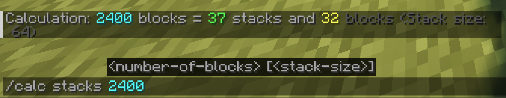

# Blocks to Stacks


**Blocks to Stacks** is a lightweight, client-side utility mod for Minecraft that handles block math directly in-game. It eliminates the need to tab out to a calculator when planning large builds or organizing storage rooms by instantly converting raw block counts into manageable Minecraft stacks.



## 🚀 Features & Usage

The mod registers a single, intuitive client-side command:

`/calc stacks <number-of-blocks> [<optional: stack size>]`

* **Default Calculation:** Type `/calc stacks 300` and the mod will instantly tell you it equals 4 stacks and 44 blocks (defaulting to a standard 64-block stack).
* **Custom Stack Sizes:** Type `/calc stacks 150 16` to accurately calculate items like Ender Pearls, Snowballs, or Signs that max out at 16 per stack.

Because the command logic and math are processed locally and printed strictly to your personal chat, this mod is **100% Client-Side**. It works flawlessly on any multiplayer server, and the server does not need the mod installed.

## 📥 Installation (For Players)

1. Download the latest `.jar` file from [Modrinth](https://modrinth.com/mod/blocks-to-stacks)
2. Ensure you have the [Fabric Loader](https://fabricmc.net/) installed for Minecraft 1.21.11.
3. Place the downloaded `.jar` and the required [Fabric API](https://modrinth.com/mod/fabric-api) into your `.minecraft/mods` folder.
4. Launch the game!

## 🛠️ Building from Source (For Developers)

To compile this project yourself, you will need **Java 21** (or higher) installed.

1. Clone the repository:
   ```bash
   git clone [https://github.com/junaidsultanxyz/blocks-to-stacks.git](https://github.com/junaidsultanxyz/blocks-to-stacks.git)
   cd blocks-to-stacks

2. Run the Gradle build task:
   - Windows: `gradlew build`
   - Mac/Linux: `./gradlew build`

3. Retrieve the compiled mod from `build/libs/`.

## 📄 License
This project is dedicated to the public domain under the CC0-1.0 License. You are free to use, modify, and distribute this code without restriction.
